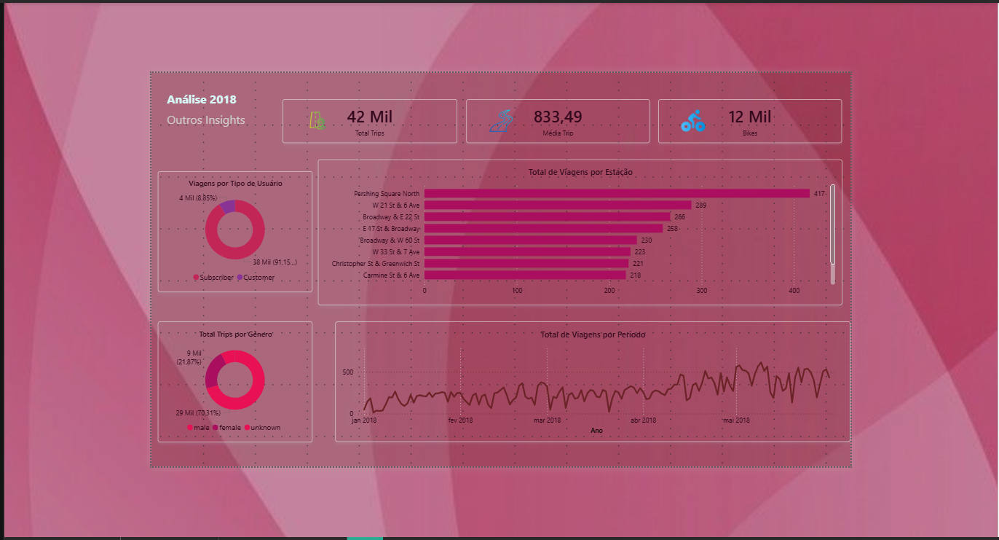
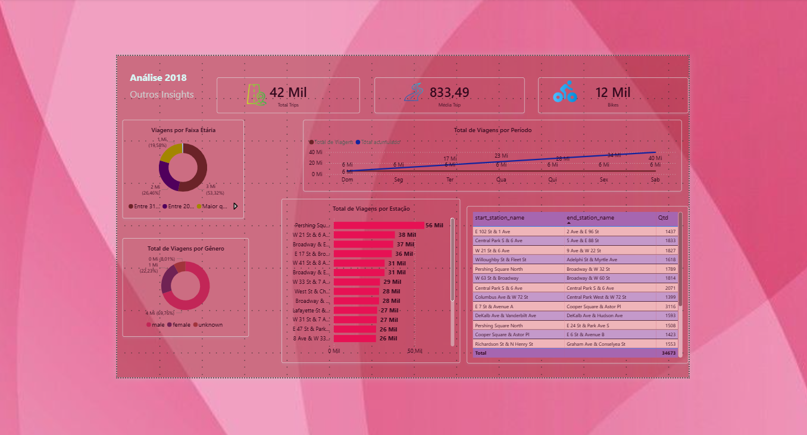

# Power BI | Citi Bike NYC (2018) — Análise de Demanda, Perfil e Distribuição

Este projeto apresenta uma solução analítica construída em **Power BI**, com foco na interpretação de dados de um sistema de bicicletas compartilhadas (Citi Bike — Nova Iorque), utilizando dados públicos para gerar **insights operacionais e estratégicos**.

O objetivo é transformar dados brutos em **painéis visuais claros**, suportando tomada de decisão sobre **demanda, horários de pico, distribuição de bicicletas, eficiência operacional e oportunidades de melhoria do serviço**.

---

## Contexto e Motivação

Sistemas de bicicletas compartilhadas operam com um desafio crítico: **equilibrar oferta e demanda em diferentes regiões e horários**.

Este projeto foi desenvolvido para responder perguntas essenciais como:

- O sistema está sendo utilizado de forma consistente ao longo do tempo?
- Em quais horários ocorre o **pico de demanda**?
- Existem estações com **alta procura** e baixa disponibilidade?
- Existem locais com **recursos parados** (bicicletas disponíveis, mas pouco utilizadas)?
- Qual é o perfil dos usuários mais recorrentes?
- Quais estações e fluxos (origem → destino) concentram maior volume?

A proposta é apoiar estratégias que tornem a operação **mais eficiente, sustentável e financeiramente otimizada**, com melhorias diretas na experiência do usuário.

---

## Objetivos do Projeto

- Criar análises visuais para interpretação do cenário atual
- Identificar **padrões de demanda por período**
- Mapear **horários de pico e comportamento de uso**
- Explorar distribuição do volume por:
  - Estações mais movimentadas
  - Rotas mais recorrentes (origem x destino)
  - Perfil de usuário (gênero / faixa etária)
- Gerar insights para suportar:
  - Rebalanceamento de bicicletas
  - Otimização de pontos de oferta
  - Melhoria do uso do sistema ao longo do dia

---

## Dashboard Desenvolvido

O projeto possui duas visões principais:

### 1) Análise 2018 (Visão Geral)
Painel com foco em indicadores globais e visão executiva:
- KPIs de volume e duração média
- Estações com maior volume
- Distribuição por tipo de usuário e gênero
- Série temporal com evolução do volume ao longo do ano

---

### 2) Análise Controlada (Insights de Perfil e Fluxo)
Painel com foco na análise segmentada e operacional:
- Distribuição por faixa etária
- Total de viagens por dia da semana
- Ranking de estações
- Tabela de rotas com origem/destino e volume

---

## Principais Indicadores e Análises

- **Total de Viagens**
- **Duração Média por Viagem**
- **Distribuição por Gênero**
- **Distribuição por Faixa Etária**
- **Estações com maior movimentação**
- **Fluxo de viagens entre estações (origem → destino)**
- **Demanda por período / dia / hora** (quando aplicável)

---

## Estratégias e Melhorias Propostas (Visão de Negócio)

Com base nas análises, este tipo de dashboard pode suportar decisões como:

### Otimização de oferta x demanda
- Detectar estações com **alta demanda e baixa oferta**
- Identificar regiões com bicicletas **ociosas** (subutilização)
- Reforçar estratégias de **redistribuição (rebalanceamento)**

### Gestão operacional mais eficiente
- Ajustar logística de reposição por horário de pico
- Priorizar áreas com maior recorrência de uso
- Reduzir tempo de indisponibilidade em pontos críticos

### Melhor experiência para o usuário
- Minimizar frustração por falta de bicicletas disponíveis
- Melhorar previsibilidade de disponibilidade em áreas-chave
- Suportar expansão sustentável do sistema

---

## Fontes de Dados e Abordagem Analítica

Este projeto parte de uma base pública, com alto volume de registros, permitindo análise realista sobre comportamento e operação.

Campos utilizados incluem (exemplos):
- Data/hora de uso
- Estações de origem e destino
- Duração da viagem
- Identificação de padrões por período
- Perfil do usuário (faixa etária / gênero)

---

## Ferramentas e Tecnologias

- **Power BI Desktop** (dashboard final)
- **Power Query** (tratamento e padronização)
- **SQL** (consulta e análise exploratória)
- **BigQuery (GCP)** (fonte e exploração inicial de dados)
- Alternativas possíveis:
  - Excel / Google Sheets (validação e análises simples)
  - Python (análise adicional e automações)
  - Looker Studio (visualização complementar)

---

## Etapas do Projeto

1. **Levantamento e entendimento do problema**
2. **Carregamento e inspeção dos dados**
3. **Tratamento e padronização (Power Query / SQL)**
4. **Análise exploratória**
5. **Criação de KPIs e medidas**
6. **Construção dos painéis e storytelling**
7. **Interpretação e comunicação dos resultados**
8. **Sugestão de melhorias e próximos passos**

---

## Estrutura Recomendada do Repositório

